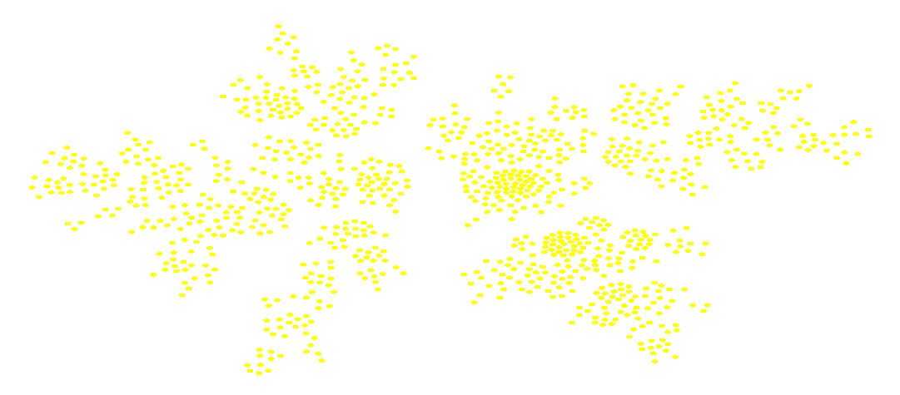

# webgpu-graph-drawing

This is a [WebGPU](https://www.w3.org/TR/webgpu/) implementation of basic [force-directed graph drawing](https://en.wikipedia.org/wiki/Force-directed_graph_drawing) of graphs generated using a [preferential attachment](https://en.wikipedia.org/wiki/Preferential_attachment) process.

The implementation is currently O(n^2). The next step is to implement a quadtree in WebGPU.

# Run

1. Open the project in [VS Code](https://code.visualstudio.com/).
1. Install the [Live Server](https://marketplace.visualstudio.com/items?itemName=ritwickdey.LiveServer) extension.
1. Right-click on `index.html` and click **Open with Live Server**.